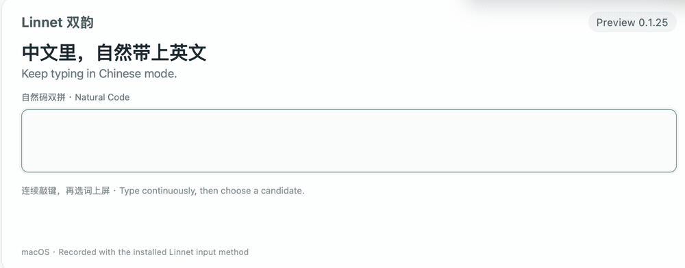
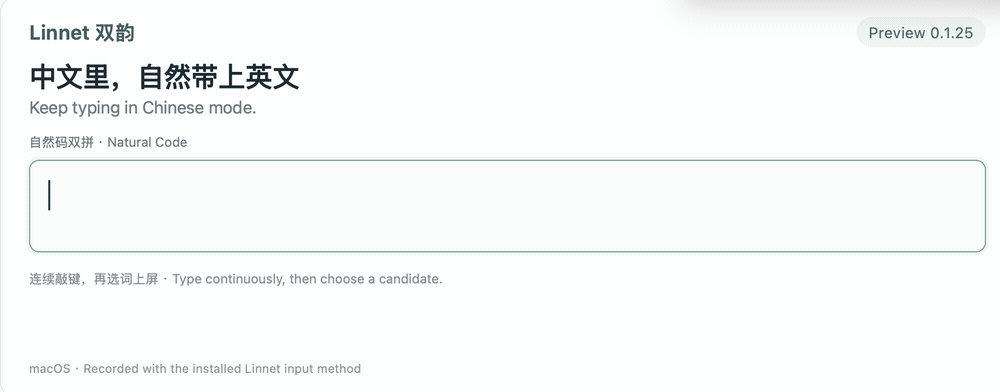

# Linnet

[简体中文](README.md) · English

<p align="center">
  
</p>

<p align="center">
  <a href="LICENSE.txt"></a>
  
  
  <a href="https://github.com/Ares-X/Linnet/actions/workflows/pull-request-ci.yml"></a>
</p>

Linnet (双韵) is an open-source bilingual input method for macOS. Chinese input and Smart English share a single system input source.

**One input source. Two languages. One continuous typing experience.**

> [!NOTE]
> For a first installation, download `Linnet.pkg`. The community edition has no Apple Developer ID signature or notarization, so macOS may require you to approve it manually. Release notes include a SHA-256 checksum for verifying your download.

**[Download the latest Linnet.pkg](https://github.com/Ares-X/Linnet/releases/latest)**

Stable: **[0.1.23 (105)](https://github.com/Ares-X/Linnet/releases/tag/v0.1.23)**. See the [changelog](CHANGELOG.en.md) for features and fixes in each version.

Try improved continuous mixed input in **[0.1.25 Preview (107)](https://github.com/Ares-X/Linnet/releases/tag/core-v0.1.25)**. Existing users can download and apply the Core update in **Settings → Data & Updates → Preview**.

[Features](#features) · [Installation](#installation) · [Usage](#usage) · [Updating and uninstalling](#updating-and-uninstalling) · [Privacy](#privacy) · [Contributing](#contributing)

## Why Linnet

- **Chinese input:** Full pinyin and seven double-pinyin layouts share dictionaries, learning data and a local language model.
- **Continuous mixed input (Preview):** Type whole English words inside Chinese sentences without committing or switching modes mid-sentence.
- **Smart English:** Completion, correction, IPA, Chinese definitions and contextual prediction, with original input preserved.
- **Personal dictionaries and offline data:** Custom words, Text Expander, learning and backups stay local, with optional iCloud learning sync.
- **Native macOS experience:** One input source, candidate windows and Settings, with seven light/dark themes.
- **Smaller updates:** Separate Core and language-data updates reuse dictionaries and models, with in-Settings updates that need no logout.

### Built on established projects, refined by Linnet

Linnet builds on Squirrel and librime, with data and capabilities from Rime Wanxiang, RIME-LMDG, rime-ice and Hallelujah. It adds reviewed Chinese corrections, a native Smart English extension, candidate interactions, and macOS settings and updates. See [third-party notices](THIRD_PARTY_NOTICES.md) for sources, modifications and licenses.

## Features

### One input source, three clear modes

| Mode | Menu bar | Use cases |
| --- | --- | --- |
| Chinese | `中` or `双` | Full or selected double pinyin, Chinese candidates and the local language model |
| Smart English | `En` | English completion, correction, definitions, pronunciation and contextual prediction |
| Raw ASCII | `A` | Code, passwords, terminals and text you want to enter without conversion |

Tap either Shift key to switch between Chinese and Smart English. Caps Lock enters or leaves raw ASCII. Both the cursor indicator and menu bar show the current mode.

<details>
<summary>View the three cursor indicators</summary>


</details>

### Chinese input

Full pinyin is the default. Settings also offers Natural Code (自然码), Xiaohe (小鹤), Microsoft, Sogou, Smart ABC, Ziguang (紫光) and Pinyin Jiajia (拼音加加) double pinyin. All eight layouts share dictionaries and learning data, with Simplified/Traditional output.

Adjacent-key and front/back nasal-final corrections are available by default. Valid original readings keep priority, and normal double-pinyin codes and abbreviations remain available. To use particular fuzzy readings regularly, choose from 12 pairs such as z/zh, n/l and in/ing in **Settings → Input → Fuzzy pinyin**; all are unchecked by default.

<details>
<summary>How correction and learning work</summary>

- When the original code forms complete pronunciations, those readings keep priority; pronunciation corrections rank ahead of adjacent-key corrections. Natural Code `hghk`, for example, retains its `heng hao` reading before suggestions such as “很好” and “更好”. Full-pinyin input is interpreted as full pinyin.
- Adjacent-key correction handles one mistyped key per syllable; several syllables may each receive a correction. Manually enabled fuzzy pairs participate beyond weak correction suggestions while retaining the original reading. The collapsed group shows your selection; click **Apply Changes** to activate it.
- Chinese learning can use standard Rime learning, Linnet enhanced learning or no learning. Enhanced learning reinforces uncommon phrases assembled character by character. English learning has its own switch. Turning learning off preserves records for later re-enabling; delete them explicitly in **Data & Updates** if needed.

</details>

**Continuous Chinese/English composition (Preview, since 0.1.24):** Type Chinese using the selected pinyin layout and English in its original spelling. You can switch languages several times before committing. These examples use Natural Code:

| Continuous keystrokes | Committed text |
| --- | --- |
| `kwregiondemigration` | 跨region的migration |
| `womfxuykalignyixwvegegapdesolution` | 我们需要align一下这个gap的solution |



_0.1.25 Preview · Safari text field in a macOS VM · Natural Code, three candidates per page. Automated key events, played at the recorded speed. Other layouts use their own Chinese codes with the same English spelling._

<details>
<summary>View the shorter 跨region的migration recording</summary>



</details>

Ambiguous words such as `size`, `mode` and `save` offer both Chinese and English candidates. Context and learning determine the order; choose a candidate when needed. With Chinese learning enabled, selected mixed phrases and English boundaries carry across full- and double-pinyin layouts. Hold Shift for uppercase abbreviations such as `CPU`, `DNS` and `HTTPS`; their spelling is preserved while surrounding pinyin forms Chinese sentences.

Other tools: `Shift+V` for symbols, `U` + a hexadecimal code point for Unicode, `cC` + an expression for calculation, and `uU` + full pinyin for character-component lookup. See also [pinyin-to-English lookup](#look-up-english-words-using-pinyin).

### Smart English

- Prefix completion, spelling correction, fuzzy matching and next-word prediction, ranked by frequency, learning and context; optional IPA and Chinese definitions.
- Initial capitalization and uppercase input are preserved; URLs, email addresses, paths, versions and code identifiers remain unchanged where possible.
- Original input is always selectable. Complete English words and clear uppercase abbreviations take priority over longer completions.

Settings controls trailing spaces after Space commits and whether Tab accepts intelligently, navigates candidates or passes through to the app. `Esc` dismisses the current prediction and clears English context.


_Left: pinyin lookup in Chinese mode. Right: English completion with IPA and Chinese definitions._

### Appearance and customization

Seven themes—宣纸, 月华, 青岩, 陶印, 雾青, 原生玻璃 and 墨朱—each have light and dark variants. Chinese and English can use different horizontal/vertical layouts. Fonts, sizes, candidate counts and expansion are configurable.

<details>
<summary>View all seven themes and layout options</summary>


| Layout | Options |
| --- | --- |
| Compact | 3, 5, 7 or 9 candidates per page |
| Horizontal expansion | 3, 4 or 5 columns and a maximum of 3, 4 or 5 rows; defaults to 5 columns, up to 3 rows |
| Vertical expansion | 5, 6 or 7 candidates per row, up to 3 rows |

Expanded candidates use a multirow grid. Arrow keys move between candidates, or can be set to always scroll by page. Expansion settings do not change the compact count. English definitions appear below the grid, follow the highlighted candidate and resize to their content.

</details>

### Download size and disk usage

Sizes use decimal MB; check the corresponding release for exact package sizes.

| Content | Reference size | Includes |
| --- | --- | --- |
| [0.1.23 complete installer](https://github.com/Ares-X/Linnet/releases/tag/v0.1.23) | **About 428 MB** | App, Chinese/English dictionaries, local model and supplementary data |
| [0.1.25 Core update](https://github.com/Ares-X/Linnet/releases/tag/core-v0.1.25) | **About 7 MB** | App only; reuses installed language data |
| [Pinned LTS model](upstreams.lock.json) | **420.25 MB** | Uncompressed model file, already included in the complete installation |

Download size is not installed disk usage: extracted data, generated schemas, learning records and backups also take space. The model's file size is not its resident memory usage.

## System requirements

Apple Silicon Mac (arm64), macOS 13 or later.

## Installation

### Get the community edition

Download `Linnet.pkg` from **[Latest Release](https://github.com/Ares-X/Linnet/releases/latest)**. To verify it, run the following in your download folder and compare with the same release's SHA-256:

```bash
shasum -a 256 Linnet.pkg
```

Linnet installs in your user directory without administrator privileges, daemons, startup items or privileged helpers.

### Enable Linnet for the first time

1. Right-click `Linnet.pkg` in Finder, choose **Open**, then confirm. If blocked, use **System Settings → Privacy & Security → Open Anyway**, then return to Installer.
2. Choose **Continue → Install** and wait for success. The app installs at `~/Library/Input Methods/Linnet.app`; do not move or copy it manually.
3. Save your work, **log out and back in once** so macOS completes initial input-source registration.
4. Add or enable **Linnet** in **System Settings → Keyboard → Text Input → Edit**, approve it when prompted, and select it from the menu bar input menu. Chinese and English share this one source; Installer does not select or approve it for you.
5. Type pinyin to check Chinese candidates, then use Shift and Caps Lock to check the [three modes](#one-input-source-three-clear-modes). Open **Settings** from the input menu.

Trust only files from this project's releases. Stop if a checksum differs or the file is reported damaged; do not disable Gatekeeper, clear quarantine attributes or run installation commands from unknown sources.

For later versions, use [Core updates in Settings](#applying-a-core-update) without adding the source again or logging out. See [Updating and uninstalling](#updating-and-uninstalling) for legacy upgrades, same-version repair or a damaged app.

## Usage

### Look up English words using pinyin

In Chinese mode, enter `|` followed by the current full-/double-pinyin code to find an English word by its Chinese meaning: full pinyin `|suanfa` and Natural Code `|srfa` can both find `algorithm`. You can explicitly choose `;` as the trigger in Settings; semicolon does not trigger lookup by default.

In Smart English, enter the current pinyin code directly, without a trigger. Ordinary English candidates rank first, original input stays available, and punctuation such as `;` passes directly to the app.

### Custom words and Text Expander

Configure these in **Settings → Dictionary**, then click **Apply Changes**:

- **Custom words:** Display text plus a lowercase Rime code, participating in normal candidates and learning. You can also add a candidate through its right-click menu, confirm the draft code and save.
- **Disabled English words:** Hide case-insensitive whole-word matches across static, learned, correction, pronunciation and prediction candidates. Forgetting a candidate's learning record only removes learning; built-in words may still appear.
- **Text Expander:** Triggers beginning with `x;` expand fixed text—for example, `x;addr` for your full address. Unknown triggers remain unchanged; expansions receive no further capitalization, spacing or definition processing.

Personal dictionary edits reload only the entries that changed.

## Settings

Open **Settings** from the input menu, with English or Simplified Chinese as the interface language. It is embedded in `Linnet.app`, not installed separately or kept in the Dock.

| Tab | Main controls |
| --- | --- |
| Appearance | Themes, light/dark appearance, fonts, candidate counts and layouts |
| Input | Chinese layouts, fuzzy pinyin, learning, Simplified/Traditional output, Emoji, punctuation, auxiliary codes and lookup; English capitalization, IPA, definitions, prediction, learning, Space and Tab. English correction and fuzzy matching are always available |
| Dictionary | Custom words, disabled English words and Text Expander |
| Data & Updates | Core/language updates, iCloud learning sync, backups and recovery, import/export, learning removal and privacy-filtered diagnostics |

Appearance changes can be previewed; input behavior changes require **Apply Changes**. Do not manually edit generated `linnet_user.custom.yaml`, `squirrel.custom.yaml`, `default.custom.yaml` or schema custom files.

**Language-data updates:** Choose stable (default) or preview in **Data & Updates**. Updates prefer deltas and reuse unchanged packs; missing or failed deltas use the corresponding full pack. Current data stays active until replacements are ready. For same-version conflicts, use the language-data repair action to download changed or conflicting full packs. Repair preserves settings, learned words and unchanged packs without downgrading or reinstalling.

## Updating and uninstalling

Routine upgrades use Core updates in Settings and reuse language data, without closing other apps, entering a password or logging out. Core is never modified automatically in the background. Language-data updates also use Settings.

Use the complete `Linnet.pkg` for first installation or app repair. Repair preserves healthy packs and personal data; uninstalling first is unnecessary. Complete, Core and language-data releases appear on stable, `core-v<version>` and `data-<sequence>` pages respectively; the latter two do not become Latest Release.

### Applying a Core update

1. Open **Settings → Data & Updates → Core update**, click **Download Core Update**, and wait for download and verification.
2. Finish or cancel composition, then switch to another input source from the macOS menu bar. Keep your other app windows open.
3. Click **Apply Update…**, which is separate from **Apply Changes** for saving settings.
4. Switch back to Linnet, type a few characters and confirm that **Running** matches **Installed**. Installed only describes files on disk.

<details>
<summary>Legacy upgrades, repair and update problems</summary>

| Situation | Action |
| --- | --- |
| Fixed-CMS versions that have completed the 0.1.15 bridge | Download and apply later Core updates in Settings; no manual asset selection or hash comparison needed |
| Fixed-CMS versions 0.1.14 and earlier | Complete the one-time 0.1.15 bridge through **Open Legacy Installer…**, then click **Apply Installed Update…** |
| Ad-hoc versions 0.1.7 and earlier, or a missing/damaged app or mismatched release identity | Repair with the complete `Linnet.pkg` |
| Same-version app repair | Use the complete `Linnet.pkg`; online Core updates only install higher versions |

- A disabled button is normal when no update is pending. For unsaved settings, data operations or other blockers, follow the card's explanation before retrying.
- If Settings shows old information, close its window and reopen it from the input menu; other apps can stay open.
- If an older Host asks you to wait for the next normal login or restart, follow that message. Repeatedly reinstalling or deleting the input source is unnecessary.
- If the app already exists, the complete installer preserves its input-source state. Add or enable a missing/disabled source in system keyboard settings without clearing registration first. Linnet does not switch sources, approve permissions or force apps to close for you.

</details>

### Uninstalling

Uninstalling permanently deletes the local app, personal data, backups and preferences. Export anything you want to keep first.

<details>
<summary>Expand the complete uninstall steps and local commands</summary>

Switch to another input source from the macOS input menu, log out and back in, then open only Terminal. The commands below run locally and do not download or execute network scripts. They permanently remove the local Linnet app, all local personal data, backups, preferences and installation receipts. Export anything you want to keep first.

```bash
/usr/bin/find -P "$HOME/Library/Application Support/Linnet" -x -type d -exec /bin/chmod u+rwx {} + 2>/dev/null || true
/bin/rm -rf -x -- "$HOME/Library/Input Methods/Linnet.app" "$HOME/Library/Application Support/Linnet"
/usr/bin/defaults delete io.github.ares-x.inputmethod.Linnet 2>/dev/null || true
/usr/bin/defaults delete io.github.ares-x.inputmethod.Linnet.settings 2>/dev/null || true
/bin/rm -f -- "$HOME/Library/Preferences/io.github.ares-x.inputmethod.Linnet.plist" "$HOME/Library/Preferences/io.github.ares-x.inputmethod.Linnet.settings.plist"
/usr/sbin/pkgutil --volume "$HOME" --pkgs | /usr/bin/grep '^io\.github\.ares-x\.inputmethod\.Linnet\..*\.pkg$' | while IFS= read -r receipt; do /usr/sbin/pkgutil --volume "$HOME" --forget "$receipt" >/dev/null; done
```

Log out and back in once more to refresh the macOS input-source list. Manage iCloud Drive sync data, recovery backups and files exported to other locations separately.

</details>

## Troubleshooting

### Linnet is missing from the system

Confirm the app is at `~/Library/Input Methods/Linnet.app`, complete the first logout/login, then add and allow Linnet in **System Settings → Keyboard → Text Input → Edit**. Control-Space only cycles through sources enabled by macOS; Linnet does not take over this shortcut.

### Only Latin letters appear

For `A` in the menu bar, turn Caps Lock off; for `En`, tap Shift. If neither `中` nor `双` appears, choose and apply a Chinese layout in **Settings → Input**, then select Linnet again.

### Settings cannot apply changes

Refresh and copy diagnostics in **Data & Updates → Diagnostics** rather than editing generated YAML. Check text and screenshots for personal information before sharing them.

### Reporting an issue

Include macOS version, Mac chip, Linnet version, download SHA-256, current input mode and Rime schema, affected app and the smallest reproducing input. Do not submit personal dictionaries, learning databases, private keys, certificate passwords or your whole user directory.

## Privacy

Input processing is local, with no accounts, telemetry, ads or analytics SDK, and no online translation, spelling or generative-model services. Personal dictionaries, learning data and local backups live in `~/Library/Application Support/Linnet/`.

**Optional iCloud:** Learning sync shares Chinese and English learning records through `iCloud Drive/Linnet`. It does not automatically sync custom words, disabled words, Text Expander or settings. Enabling sync or manually uploading backups places the corresponding personal data in your iCloud Drive.

<details>
<summary>Sync, backups, import and export scope</summary>

- Automatic sync checks at most once an hour; immediate sync is also available. You can keep typing, with no need to have used both modes or keep a document open.
- Settings reports local merge/export times and failure or retry status. Local completion does not mean another Mac has received the data; iCloud Drive handles delivery.
- **Data & Updates** supports uploading and reviewing incremental recovery backups, viewing transaction recovery records, and importing/exporting data. Imports require confirmation and first create a local backup. With no usable cloud history, uploads add a full backup without deleting existing backups.
- Other Rime/Hallelujah data is read only when you explicitly import it. Exported files may contain personal data; you manage their storage and deletion.

</details>

**Update networking:** Opening Settings requests GitHub's update catalog; Core/language files download only after you start the relevant update. Downloads use the selected source; changing it affects subsequent downloads, with no automatic switching or fallback. Third-party mirrors can see your IP, request time and public file URL. Linnet sends no personal dictionaries, learning data, backups, diagnostics or credentials to GitHub or mirrors.

## Contributing

Building Linnet requires an Apple Silicon Mac, macOS 13+, full Xcode, Git and `ripgrep`. The project primarily uses Swift/SwiftUI, C++, Shell and Ruby, and does not bundle a Python runtime.

```bash
./action-build.sh release
tests/verify_swift_units.sh --list
tests/verify_swift_units.sh --only OWNER
```

Ordinary development requires neither a signing certificate nor registering the local build as a system input method. See the [development guide](docs/development.md) for repository structure, data generation, upstream synchronization, test levels and local acceptance. See the [release guide](docs/release.md) for packaging, signing and publication.

## Versions, sources and licenses

Linnet is an independent community distribution derived from Squirrel, not an official release of any upstream project. This repository modifies upstream code and data; its first public modified release was dated 2026-08-20. The main relationships are:

| Upstream | Use and modifications in Linnet | License summary |
| --- | --- | --- |
| [Squirrel](https://github.com/rime/squirrel) / [librime](https://github.com/rime/librime) | macOS input-method and Rime runtime foundations; modified product identity, single-source bilingual workflow, candidate interactions, native Settings and release packaging | GPL-3.0-only (Squirrel); BSD-3-Clause (librime) |
| [Rime Wanxiang](https://github.com/amzxyz/rime-wanxiang) | Core Chinese dictionaries and eight full-/double-pinyin layouts; pinned upstream tables with reviewed pronunciation, code and ranking corrections | CC BY 4.0 |
| [RIME-LMDG](https://github.com/amzxyz/RIME-LMDG) | Pinned Wanxiang LTS language model bundled for offline use | CC BY 4.0 |
| [rime-ice](https://github.com/iDvel/rime-ice) / [HallelujahIM](https://github.com/dongyuwei/hallelujahIM) | Selected rime-ice Chinese extension entries of three or more characters, English, components, symbols, Emoji/OpenCC and Lua inputs; selected Hallelujah frequency, pronunciation and definition inputs. Linnet data is generated through deterministic projection, normalization and manual review | GPL-3.0-only; see third-party notices for exact scope |
| librime-lua, librime-octagram, librime-predict and other runtime dependencies | Statically integrated or embedded in the app, rather than used as a second product source | See third-party notices, release NOTICE and SBOM |

See [third-party sources, modifications and licenses](THIRD_PARTY_NOTICES.md) for complete attribution and scope, and [`LICENSES/`](LICENSES/) for license texts. Stable distribution packages also carry `NOTICE.md`, `SBOM.spdx.json`, `VERSION.json` and license files tied to the exact version and commit, so the delivered contents have their own precise records beyond this README summary.

Linnet's own source code is licensed under [GPL-3.0-or-later](LICENSE.txt).
