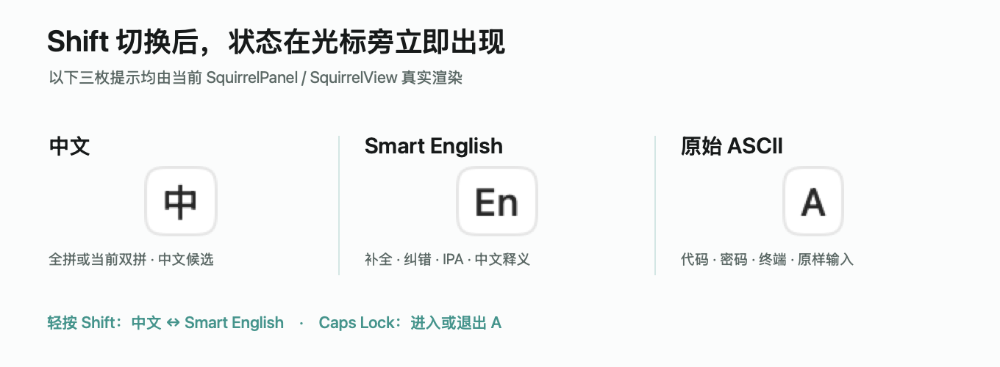
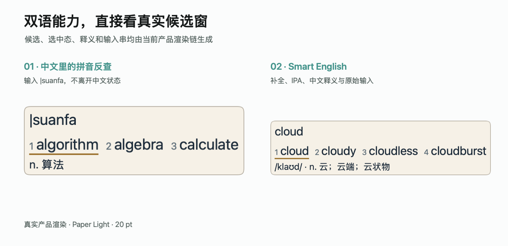
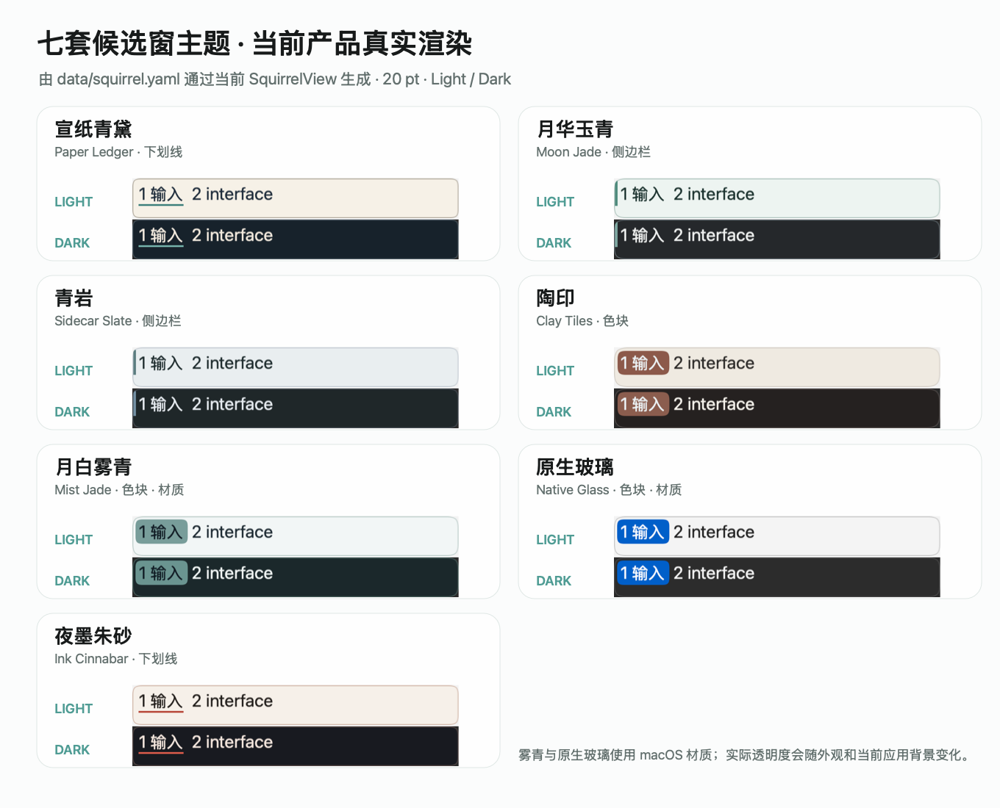

# Linnet

<p align="center">
  
</p>

Linnet（双韵）是一款为 macOS 打造的开源双语输入法。它把中文输入与 Smart English 放进同一个系统输入源：轻按 Shift 即可往返，Caps Lock 则随时进入不经过转换的原始 ASCII。

**一个输入源，两种语言，一种连贯的输入体验。**

> [!NOTE]
> 首次安装请下载 `Linnet.pkg`。社区版没有 Apple Developer ID 签名或公证，macOS 可能要求手动确认信任；安装前请核对同一 Release 说明中的 SHA-256。

**[下载最新版 Linnet.pkg](https://github.com/Ares-X/Linnet/releases/latest)**

本文对应本分支版本；正式可下载版本以 Latest Release 为准，各版本的功能与变化见[版本记录](CHANGELOG.md)。

[产品体验](#产品体验) · [安装](#安装) · [使用指南](#使用指南) · [升级与卸载](#升级与卸载) · [隐私](#隐私) · [参与贡献](#参与贡献)

## 为什么选择 Linnet

- **中英自然切换**：中文与 Smart English 共用一个 macOS 输入源，不用在系统输入法列表里来回寻找。
- **完整的中文体验**：内置全拼与七种双拼方案，共用同一套中文候选、学习数据和本地语言模型。
- **真正面向英文输入**：Smart English 提供补全、拼写建议、IPA、中文释义、上下文预测与连续输入处理，同时始终保留原始输入。
- **离线且可掌控**：个人词、学习数据、Text Expander 和备份默认保存在本机；启用后，macOS 通过 Linnet 固定的 `iCloud Drive/Linnet` 目录同步 Rime 学习词。
- **原生 macOS 产品**：菜单栏状态、候选窗与 Settings 形成统一体验，并提供浅色、深色和多套候选主题。
- **核心与语言数据分开更新**：更新界面或程序时复用已安装的词库和模型，语言包优先使用差分；支持设置内 Core 更新的版本无需关闭其他应用或再次注销。
- **常用内容随手输入**：自定义词进入正常候选与学习流程，Text Expander 用短码展开地址、邮箱或固定回复；修改后只增量加载实际变化的个人词典。

### 基于成熟上游，由 Linnet 精校与增强

Linnet 基于 Squirrel／librime，结合万象词库、RIME-LMDG 模型、rime-ice 与 Hallelujah 的数据与能力，提供中文精校、原生 Smart English 扩展、候选交互及 macOS 设置与更新。来源、修改范围与许可证见[第三方来源说明](THIRD_PARTY_NOTICES.md)。

## 产品体验

### 一个输入源，三个明确状态

| 状态 | 菜单栏 | 适合场景 |
| --- | --- | --- |
| 中文 | `中` 或 `双` | 全拼或当前双拼、中文候选、本地语法模型 |
| Smart English | `En` | 英文补全、纠错、释义、发音与上下文预测 |
| 原始 ASCII | `A` | 代码、密码、终端和任何不希望被转换的文本 |

轻按左 Shift 或右 Shift 切换中文与 Smart English；Caps Lock 进入或退出原始 ASCII。



_光标旁提示当前输入状态；菜单栏同步显示 `中`/`双`、`En` 或 `A`。_

### 中文输入

Linnet 首次使用默认全拼，也可以在 Settings 中选择自然码、小鹤、微软、搜狗、智能 ABC、紫光或拼音加加。八种方案共享中文词库与学习数据，切换方案不需要重新建立个人词频。候选输出支持简体与繁体切换。

中文可选择标准 Rime 学习、Linnet 增强学习或关闭学习；增强学习会对逐字组成的生僻词组补充学习强化。英文学习单独开关，关闭学习保留已有记录，重新启用后继续使用；需要删除时再到“数据与更新”中清理。

中文候选支持横排、竖排与多行展开，未展开时每页可选 3／5／7／9 项。展开后用方向键在网格中移动，也可以选择始终按页滚动。

在中文连续输入中，按住 Shift 输入全大写缩写时，缩写会保持原样，左右两侧的拼音仍继续匹配并组成中文句子。小写输入也可根据上下文提供中英混合候选，由整句评分参与排序，不强制置顶。

常用辅助入口包括：

- `Shift+V`：符号命令；
- `U` + 十六进制码点：Unicode 输入；
- `cC` + 表达式：本地计算器；
- `uU` + 全拼：部件拆字查询；
- `|` + 当前拼音编码：在中文模式中反查英文；也可在 Settings 中显式改用 `;`。

### Smart English

Smart English 适合连续英文写作，也适合在中文工作流中临时输入术语：

- 前缀补全、拼写纠错、模糊匹配与下一词预测，结合词频、学习记录和上下文排序；
- 可选 IPA 和中文释义；
- 保留首字母大写或全大写；
- Space 上屏时是否自动附加空格可在 Settings 中配置；
- URL、邮箱、路径、版本号和代码标识符尽可能保持原文；
- 原始输入始终保留；已构成完整英文词或明确的全大写缩写时，原文优先于更长的补全结果。

Tab 可以设为智能接受、候选导航，或完全交给当前应用。按 `Esc` 可关闭本次预测并清除当前英文上下文。



_左侧为中文模式的拼音反查，右侧为带 IPA 和中文释义的英文补全。_

### 外观与个性化

横向展开的列数与最多行数分别可选 3／4／5，默认 5 列、最多 3 行；纵向展开每行可选 5／6／7 项、最多 3 行。展开设置不影响紧凑状态的候选数量。

候选窗口提供宣纸、月华、青岩、陶印、雾青、原生玻璃和墨朱七套主题，每套都包含浅色与深色版本。中文与英文可以分别选择紧凑状态下的横排或竖排；展开后统一使用多行网格。英文释义显示在网格下方，随高亮候选更新并按实际内容调整高度，不额外预留空白。字体、字号、候选数量和展开方式也可以独立调整。



### 下载大小与磁盘空间

完整安装包包含程序、中文与英文词库、本地语言模型和辅助数据；核心更新只更新程序部分。以下是固定版本的参考值，采用十进制 MB：

| 内容 | 大小 | 说明 |
| --- | --- | --- |
| 完整安装包 | **约 428 MB** | `Linnet.pkg`，包含离线语言数据 |
| Core 更新包 | **约 7 MB** | 仅更新程序，复用已安装词库与模型 |
| [当前锁定的 LTS 模型](upstreams.lock.json) | **420.25 MB** | 模型文件的未压缩大小，已包含在完整安装内容中，无需额外下载 |

**下载大小不等于安装后占用。** 磁盘还会保存解压后的语言数据、生成的输入方案、学习记录与备份；总占用随使用情况变化。模型文件大小也不代表它会全量常驻内存。

核心与词包分离后，日常程序升级可复用大体积语言数据。语言包更新优先使用差分，未变化的词包直接复用；无法使用差分时，设置会提示确认完整修复。

## 系统要求

- Apple Silicon Mac（arm64）；
- macOS 13 或更高版本。

## 安装

### 获取社区版本

请从项目的 **[Latest Release](https://github.com/Ares-X/Linnet/releases/latest)** 只下载一个文件：`Linnet.pkg`。进入下载目录后计算哈希：

```bash
shasum -a 256 Linnet.pkg
```

输出必须与同一 Release 说明中列出的 64 位 SHA-256 完全一致。Linnet 安装到当前用户目录，不需要管理员权限，也不会安装守护进程、启动项或特权辅助程序。

### 首次启用

1. 在 Finder 中按住 Control 点击（或右键点击）已校验的 `Linnet.pkg`，选择 **打开**，再次确认 **打开**。若系统没有显示该选项，请打开 **系统设置 → 隐私与安全性**，在 Linnet 的拦截提示旁选择 **仍要打开**，然后返回安装器。
2. 在 macOS 安装器中依次选择 **继续 → 安装**并等待“安装成功”。Linnet 只安装到当前用户的 `~/Library/Input Methods/Linnet.app`；不要把 App 手工拖动或复制到其他目录。
3. 保存工作，注销当前 macOS 账户并重新登录。这一步只在第一次安装时执行，用于让 macOS 完成输入源登记；以后安装 Core 更新不需要再次注销。
4. 重新登录后打开 **系统设置 → 键盘 → 文本输入 → 编辑**。如果列表中已有 Linnet，确认它已启用；如果没有，点击 **+**，搜索或找到 **Linnet**，选择后点击 **添加**，并按 macOS 提示允许该输入源。
5. 从菜单栏输入菜单中选择带小鸟图标的 **Linnet**。选择始终由用户和 macOS 管理，安装器不会代替你切换。这只是一个 Linnet 输入源，不需要分别添加中文和英文。
6. 确认菜单栏显示 `中`/`双`，输入拼音可以提交中文候选；独立轻按 Shift 应显示 `En` 并输入英文，Caps Lock 应显示 `A`；输入菜单中的 **Settings** 应能打开设置窗口。

已完成首次安装的用户，后续从 Settings 检查、下载并应用 Core 更新，不必重新添加输入源；旧版本需先完成一次桥接升级，见[升级与卸载](#升级与卸载)。**安装成功不等于新代码已经运行**：旧式安装包只替换磁盘文件，还需在设置中应用已安装的更新。具体操作见[应用核心更新](#应用核心更新)。

Linnet 不会自动点击系统授权、选择或停用输入源。若 Linnet 被 macOS 移除或停用，请在 **系统设置 → 键盘 → 文本输入 → 编辑** 中重新添加或启用。社区安装包没有 Apple Developer ID 签名或公证，因此“无法验证开发者”是预期提示；只应在文件名和 Release 中的 SHA-256 都校验成功后手动信任。不要关闭 Gatekeeper、清除隔离属性或执行来源不明的安装命令；校验和不一致或系统报告文件损坏时应立即停止。

## 使用指南

### 拼音反查英文

只记得中文意思时，可以用拼音找英文词，无需离开输入窗口。在中文模式中，先输入 Settings 选择的触发键，再输入当前全拼或双拼编码。默认触发键是 `|`；如果用户明确选择 `;`，分号才会成为反查触发键。

```text
|suanfa  → algorithm
```

选择自然码后，同一示例可以写成 `|srfa`。Smart English 中直接输入当前全拼或双拼编码即可查看英文候选，不使用反查触发键；普通英文候选仍排在前面，拼音结果不会取代原始输入，`;` 等标点始终直接交给当前应用。

### 自定义词与 Text Expander

在 **Settings → 词典**中配置常用名称、短语和固定文本：

- **自定义词**由显示文本和小写 Rime code 组成，会进入正常候选和学习流程。
- **禁用英文词**按大小写不敏感的完整词隐藏静态、学习、纠错、发音和预测候选。
- **Text Expander**触发器必须以 `x;` 开头；未知触发器按原文保留，展开值不会再经过大小写、空格或释义处理。

候选窗支持右键“添加到自定义词…”，将词填入词典草稿；确认编码后点击“应用更改”保存。也可以右键“忘记此候选的学习记录”；内置词仍可能出现。需要隐藏英文词时，使用“禁用英文词”。

例如，添加触发器 `x;addr`，将展开值设为完整地址；以后输入这个短码即可展开保存的文本。

点击 **应用更改** 保存。

## 设置

从 macOS 输入菜单选择 **Settings**，界面支持 English 与简体中文。设置窗口内嵌在 `Linnet.app` 中，不会作为独立应用安装，也不会常驻 Dock。

| 标签 | 可以管理的内容 |
| --- | --- |
| 外观 | 七套主题、浅色/深色、字体、字号、候选数量、横排/竖排与候选展开方式 |
| 输入 | 中文区管理全拼/双拼、学习、简繁、Emoji、标点、辅助码和反查；Smart English 区管理自动大写、IPA、释义、预测、学习、Space 尾随空格和 Tab；英文纠错与模糊匹配始终可用 |
| 词典 | 自定义词、禁用英文词与 Text Expander |
| 数据与更新 | Core 与词包版本、iCloud Drive 增量学习同步、手动增量恢复备份、事务恢复记录、导入导出、学习数据清理与隐私处理后的诊断 |

外观预览会使用所选主题、字号与布局；需要改变输入行为的选项在点击 **Apply Changes** 后生效。请不要手工编辑 Linnet 生成的 `linnet_user.custom.yaml`、`squirrel.custom.yaml`、`default.custom.yaml` 或 schema custom 文件。

在“数据与更新”中选择 **正式版**（默认）或 **预览版**，查看程序和词库的已安装与可用版本。语言数据优先使用差分更新，未变化的词包直接复用；差分失败时保留当前数据，并询问是否下载有变化的完整词包修复。

若提示同版本词包冲突，或差分更新反复失败，可点击 **修复语言数据更新…**，确认后下载所选频道中有变化或冲突的完整词包。修复保留学习词、个人设置和未变化的词包，不降级词包，也不需要重装输入法。

## 升级与卸载

Linnet 不会在后台自动修改 Core。Settings 检查到更新后，只有用户点击 **下载核心更新 / Download Core Update** 才会下载并校验 Catalog 绑定的精确文件。安装了 0.1.15 桥接版后，后续 Core 可在设置中点击 **应用更新… / Apply Update…** 完成：先切换到其他输入法，其他应用保持打开，不需要 Installer、密码、注销或重启。

正式版本页只提供完整安装包；`core-v<version>` 预发布页供已有用户免注销更新，`data-<sequence>` 预发布页供 Settings 更新语言数据。它们不会成为 Latest Release。

0.1.15 是一次性桥接版：0.1.14 及更早的固定 CMS 版本仍会下载旧式 Core PKG，并显示 **打开旧版安装器… / Open Legacy Installer…**；只需按 macOS 提示完成这一次升级。之后在 Settings 中下载并应用核心更新即可，不需要寻找发布页中的文件或手工比对哈希。0.1.7 或更早的旧 ad-hoc 版本、App 缺失或损坏时仍须运行完整 `Linnet.pkg` 修复。

### 应用核心更新

1. 从 Linnet 输入菜单打开 **Settings**。
2. 进入 **数据与更新 → 核心更新**（**Data & Updates → Core update**）。查看“已安装”和“正在运行”：前者是磁盘上的版本，后者是当前输入法进程实际加载的版本。
3. 若有可下载的 Core 更新，先点击 **下载核心更新**，等待下载和验证完成。
4. 完成或取消当前组词，再从 macOS 输入菜单切换到其他输入法，保留正在使用的应用窗口。
5. 新式在线更新点击 **应用更新…**（**Apply Update…**）；若刚通过旧式 PKG 完成桥接，则点击 **应用已安装的更新…**（**Apply Installed Update…**）。不要把它们与用于保存设置的 **Apply Changes** 混淆。
6. 操作完成后切回 Linnet，输入几个字确认候选窗正常；回到核心更新卡片，确认“正在运行”与“已安装”一致。

升级后若 Settings 仍显示旧信息，请关闭设置窗口并从 Linnet 输入菜单重新打开，无需退出其他应用。

没有待应用更新时，按钮置灰是正常的。有未保存的设置或正在进行的数据操作时，请先完成页面提示的操作。应用被阻止时，根据卡片说明处理后重试；Linnet 不会替你切换输入源或强制关闭用户应用。若旧版 Host 不支持当前会话内应用更新，会明确提示等下次正常登录或重启后生效，不应反复重装或删除输入源。支持会话内更新的 Host 无需注销。

固定 CMS 版本之间的正常升级只使用 Core；0.1.7 或更早的旧 ad-hoc 版本，以及 App 缺失、损坏或发布身份不符时，使用完整 `Linnet.pkg`。Complete 保留健康的已安装词包与个人数据；若 App 已存在，它也不会触碰输入源状态。注册缺失或停用由 **系统设置 → 键盘 → 文本输入 → 编辑** 处理，而不是让安装器重复申请授权。重复、冲突或无法验证的系统残留必须先执行下文的离线卸载命令，再重新安装 Complete。不要手工复制 App 或绕过检查。

### 卸载

先从 macOS 输入菜单切换到其他输入法，注销并重新登录，然后只打开 Terminal。以下命令完全在本机运行，不下载或执行网络脚本。它会永久删除本机 Linnet App、全部本地个人数据、备份、偏好和安装记录；需要保留的数据请先导出。

```bash
/usr/bin/find -P "$HOME/Library/Application Support/Linnet" -x -type d -exec /bin/chmod u+rwx {} + 2>/dev/null || true
/bin/rm -rf -x -- "$HOME/Library/Input Methods/Linnet.app" "$HOME/Library/Application Support/Linnet"
/usr/bin/defaults delete io.github.ares-x.inputmethod.Linnet 2>/dev/null || true
/usr/bin/defaults delete io.github.ares-x.inputmethod.Linnet.settings 2>/dev/null || true
/bin/rm -f -- "$HOME/Library/Preferences/io.github.ares-x.inputmethod.Linnet.plist" "$HOME/Library/Preferences/io.github.ares-x.inputmethod.Linnet.settings.plist"
/usr/sbin/pkgutil --volume "$HOME" --pkgs | /usr/bin/grep '^io\.github\.ares-x\.inputmethod\.Linnet\..*\.pkg$' | while IFS= read -r receipt; do /usr/sbin/pkgutil --volume "$HOME" --forget "$receipt" >/dev/null; done
```

完成后再次注销并重新登录，以刷新 macOS 输入源列表。iCloud Drive 中的同步数据与恢复备份，以及导出到其他目录的文件，需自行另行管理。

## 故障排查

### 系统找不到 Linnet

- 确认安装位置是 `~/Library/Input Methods/Linnet.app`；
- 完成一次真正的注销并重新登录；
- 在 **系统设置 → 键盘 → 文本输入 → 编辑** 中手动添加并允许 Linnet；
- Control-Space 只会轮换 macOS 已启用的输入源，Linnet 不接管这个系统快捷键。

### 只能输入字母

- 菜单栏为 `A`：关闭 Caps Lock；
- 菜单栏为 `En`：轻按 Shift 返回中文；
- 没有 `中`/`双`：在 **Settings → 输入**选择中文方案并应用，再重新选择 Linnet。

### Settings 无法应用

不要手工修改生成的 YAML。前往 **数据与更新 → 诊断**（**Data & Updates → Diagnostics**）刷新并复制诊断；公开前仍需人工检查文本与截图，避免包含个人信息。

### 报告问题

请提供 macOS 版本、Mac 芯片、Linnet 版本、下载文件 SHA-256、当前状态、Rime 方案、发生问题的应用和最小复现输入。不要提交个人词典、学习数据库、私钥、证书密码或完整用户目录。

## 隐私

Linnet 没有账户体系、遥测、广告或分析 SDK，也不调用在线翻译、在线拼写或生成式模型。输入处理在本机完成；个人词典、学习数据和本地备份默认保存在以下目录：

```text
~/Library/Application Support/Linnet/
```

启用 iCloud 同步或手动上传备份后，相应个人数据也会进入你的 iCloud Drive。

只有用户在 Settings 中明确选择导入时，Linnet 才会读取其他 Rime 或 Hallelujah 数据。导出文件可能包含用户主动选择的个人数据，需由用户自行妥善保存与删除。

iCloud 学习词同步为可选功能，通过 `iCloud Drive/Linnet` 同步中英文学习记录。自动检查最多每小时一次，也可点击“立即同步”，同步期间可以继续输入。

设置显示本机上次成功合并与导出学习数据的时间，以及失败或待重试的状态。本机完成不代表其他 Mac 已经收到数据；跨设备传输仍由 iCloud Drive 完成。

自动同步只处理学习词，自定义词、停用词、Text Expander 和设置不随之同步。迁移或恢复时，可在“数据与更新”中手动上传、审阅恢复备份，或导入导出个人数据；导入需确认，并会先创建本地备份。云端备份无法继续追加时，可确认新建完整备份，已有备份不会被删除。

更新联网由 Settings 处理：打开设置时向 GitHub 请求小型更新目录以检查版本，用户明确点击核心或语言数据更新后才下载对应文件。两者都使用“数据与更新”中的下载源选择；更改来源只影响之后开始的下载，不会自动切换或回退。第三方下载镜像可能看到 IP、请求时间与公开文件 URL，但 Linnet 不会向 GitHub 或镜像发送个人词典、学习数据、备份、诊断或凭据。

## 参与贡献

构建 Linnet 需要 Apple Silicon Mac、macOS 13+、完整 Xcode、Git 和 `ripgrep`。项目主要使用 Swift/SwiftUI、C++、Shell 与 Ruby，不携带 Python 运行时。

```bash
./action-build.sh release
tests/verify_swift_units.sh --list
tests/verify_swift_units.sh --only OWNER
```

普通开发不需要签名证书，也不需要把本地构建注册为系统输入法。目录结构、数据生成、上游同步、测试层级与本机验收方法请阅读[开发指南](docs/development.md)；打包、签名和公开发布流程请阅读[发布指南](docs/release.md)。

## 版本、来源与许可证

当前正式版本见 [Latest Release](https://github.com/Ares-X/Linnet/releases/latest)，预览版本及用户可见变化见[版本记录](CHANGELOG.md)。

Linnet 是从 Squirrel 修改而来的独立社区发行版，不代表任何上游项目的官方发行。本仓库已修改上游代码与数据；首个公开修改版日期为 2026-08-20。主要关系如下：

| 上游来源 | Linnet 的使用与修改 | 许可证摘要 |
| --- | --- | --- |
| [Squirrel](https://github.com/rime/squirrel) / [librime](https://github.com/rime/librime) | macOS 输入法与 Rime 运行时基础；修改了产品身份、单输入源双语工作流、候选交互、原生 Settings 与发行打包 | GPL-3.0-only（Squirrel）；BSD-3-Clause（librime） |
| [Rime Wanxiang](https://github.com/amzxyz/rime-wanxiang) | 中文词典核心与八种全拼/双拼布局；锁定上游表，并应用经过审核的读音、错码与排序修正 | CC BY 4.0 |
| [RIME-LMDG](https://github.com/amzxyz/RIME-LMDG) | 锁定并离线打包 Wanxiang LTS 语法模型 | CC BY 4.0 |
| [rime-ice](https://github.com/iDvel/rime-ice) / [HallelujahIM](https://github.com/dongyuwei/hallelujahIM) | 选取 rime-ice 三字及以上中文扩展词及英文、部件、符号、Emoji/OpenCC、Lua 输入，并选取 Hallelujah 词频、发音与释义输入；经确定性投影、归一化和人工审核生成 Linnet 数据 | GPL-3.0-only；精确适用范围见第三方声明 |
| librime-lua、librime-octagram、librime-predict 及其他运行时依赖 | 随 App 静态集成或嵌入，未作为第二套产品来源 | 以第三方声明、发行 NOTICE 与 SBOM 为准 |

完整的来源范围、修改说明和许可证关系见[第三方来源、修改与许可证](THIRD_PARTY_NOTICES.md)，许可证文本见 [`LICENSES/`](LICENSES/)。正式发行包还会携带绑定到精确版本与提交的 `NOTICE.md`、`SBOM.spdx.json`、`VERSION.json` 和许可证文件，避免 README 摘要与实际交付内容漂移。

Linnet 自有源码采用 [GPL-3.0-or-later](LICENSE.txt) 许可证。
